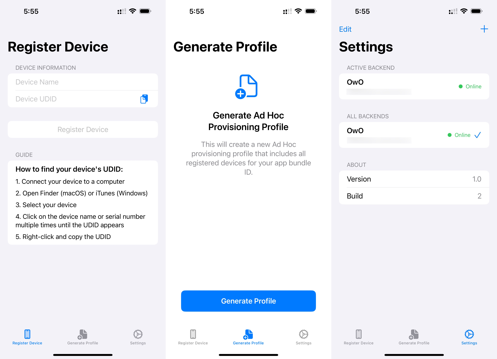

# Devices

An iOS application for managing Apple Developer devices and profiles across multiple backend servers.



## Overview

Devices is a native iOS application designed to help developers and system administrators manage device registrations and provisioning profiles for Apple development. The app allows you to connect to multiple backend servers, register devices with Apple, and create & download provisioning profiles directly on your iOS device.

## Features

- **Multi-Backend Support**: Connect to and manage multiple backend servers
- **Server Health Monitoring**: Check the online/offline status of your backend servers
- **Device Registration**: Register iOS devices with Apple Developer Program
- **Profile Management**: Create and download mobile provisioning profiles
- **Secure Authentication**: API Key-based authentication with your backends

## Getting Started

### Requirements

- iOS 15.0 or later
- Xcode 13.0 or later (for development)
- Swift 5.5 or later (for development)
- Backend server with Apple Developer Program integration

### Installation

1. Clone the repository
   ```bash
   git clone https://github.com/yourusername/devices.git
   ```

2. Open the project in Xcode
   ```bash
   cd devices
   open Devices.xcodeproj
   ```

3. Build and run the application on your device or simulator

### Backend Configuration

To use Devices, you'll need a compatible backend server that implements:

- `/health` endpoint for server health checks
- `/api/devices` endpoint for device registration
- `/api/profiles/create-and-download` endpoint for profile creation and download

Configure your backend details in the app:
1. Launch the app
2. Tap the "+" button to add a new backend
3. Enter backend name, URL, and API key
4. Test connection and save

## Architecture

Devices is built using SwiftUI and follows the MVVM (Model-View-ViewModel) pattern:

- **Models**: Data structures representing backends, devices, and profiles
- **Views**: SwiftUI views for the user interface
- **Services**: API service for backend communication

Key components:
- `APIService`: Manages backend connections and API calls
- `BackendSelectionView`: Primary interface for selecting and managing backends
- `SettingsView`: Configuration interface for managing app settings

## Contributing

Contributions are welcome! Please feel free to submit a Pull Request.

1. Fork the repository
2. Create your feature branch (`git checkout -b feature/amazing-feature`)
3. Commit your changes (`git commit -m 'Add some amazing feature'`)
4. Push to the branch (`git push origin feature/amazing-feature`)
5. Open a Pull Request

## License

This project is licensed under the MIT License - see the LICENSE file for details.

## Acknowledgements

- [SwiftUI](https://developer.apple.com/xcode/swiftui/) - UI framework
- [Combine](https://developer.apple.com/documentation/combine) - Reactive programming framework
